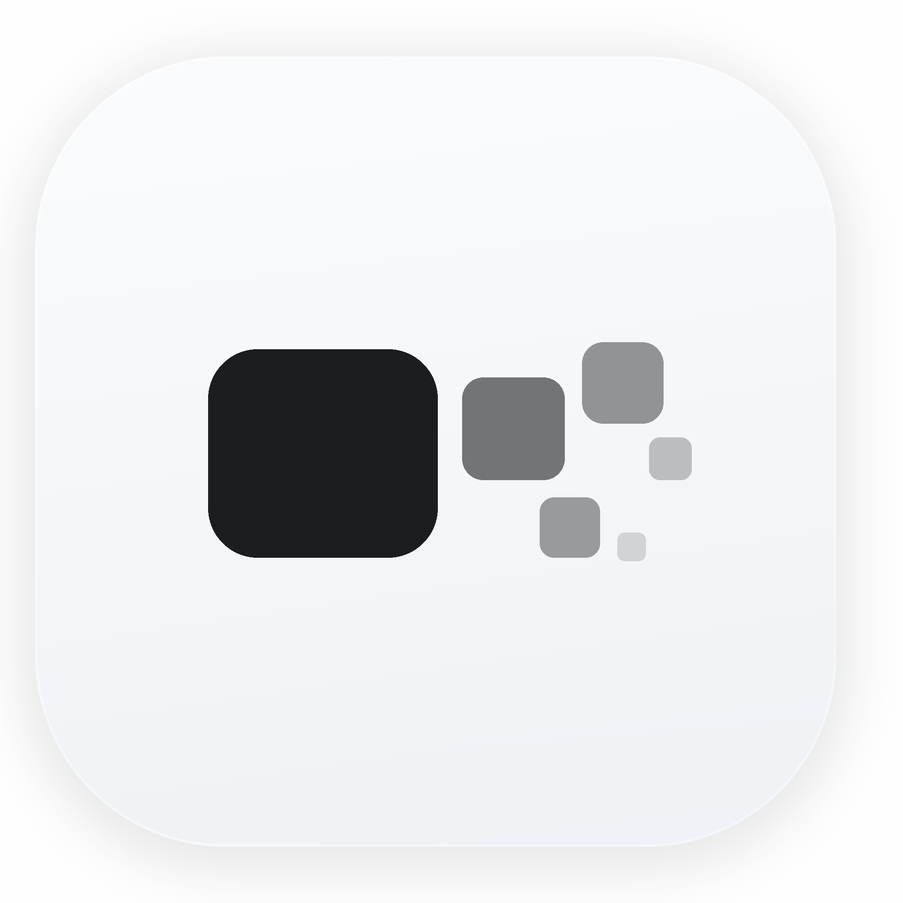

<p align="center">
  
</p>

<h1 align="center">Peeko</h1>

<p align="center">
  <strong>Live in the corner. Gone in a keystroke.</strong>
</p>

<p align="center">
  A quiet always-on-top mini browser for macOS video pages.
</p>

<p align="center">
  <a href="#english">English</a>
  ·
  <a href="#中文">中文</a>
  ·
  <a href="https://peeko.zx-will.com">Website</a>
  ·
  <a href="https://github.com/ZixuanW46/peeko/releases">Releases</a>
</p>

<p align="center">
  
  
  
</p>

## English

Peeko is a small macOS utility that turns web video pages into a clean floating corner window. It behaves like a quiet menu bar companion: open a page, let Peeko isolate the video, then control it with global shortcuts while your main workspace stays in front.

Peeko is not a content platform. It is a local browser shell for pages you choose to open.

### Highlights

| Feature | What it does |
| --- | --- |
| Floating corner window | Keeps a web video above normal apps and full-screen spaces. |
| Browser / Cinema Mode | Browse normally, then switch to a clean video-focused view. |
| Global shortcuts | Hide, peek, play, mute, switch modes, and toggle click-through without touching the window. |
| Hold to peek | Hold a shortcut to reveal the window, release to hide it again. |
| Click-through | Let mouse events pass through Peeko to the app underneath. |
| Menu bar first | Runs quietly from the macOS menu bar without needing to live in the Dock. |
| Manual updates | Checks GitHub Releases and downloads updates only after you confirm. |

### Default Shortcuts

All shortcuts can be changed in Settings.

| Shortcut | Action |
| --- | --- |
| `Control + Z` | Hide / restore picture while audio continues. |
| `Control + X` | Hold to peek. |
| `Control + C` | Quick vanish: hide, mute, and pause; press again to restore. |
| `Control + P` | Play / pause. |
| `Control + M` | Mute toggle. |
| `Control + B` | Browser / Cinema Mode. |
| `Control + T` | Click-through toggle. |
| `Control + Enter` | Peeko window fullscreen. |

### Download

Peeko is currently built for Apple Silicon Macs.

- Website: [peeko.zx-will.com](https://peeko.zx-will.com)
- Releases: [github.com/ZixuanW46/peeko/releases](https://github.com/ZixuanW46/peeko/releases)

The first update-enabled version is `0.1.1`. Older local builds cannot receive automatic updates retroactively and need to be replaced manually.

### Permissions

Peeko may ask for macOS Accessibility permission so it can listen for global key-down / key-up events, which powers hold-to-peek. Website sessions and cookies stay inside Peeko's local Electron browser session.

### Development

```bash
npm install
npm run dev
```

Quality checks:

```bash
npm run lint
npm run typecheck
npm test
```

Build locally:

```bash
npm run build:mac
```

Release for macOS:

```bash
npm run release:mac
```

The release script builds, signs, notarizes, staples, verifies, pushes the matching git tag, and uploads only the release artifacts to GitHub Releases.

## 中文

Peeko 是一个安静的 macOS 置顶迷你浏览器。它可以把网页视频整理成干净的角落浮窗，让主工作区保持在前，同时用全局快捷键控制显示、隐藏、播放、静音和穿透。

Peeko 不是内容平台，也不托管视频。它只是一个本地浏览器外壳，打开什么页面由用户自己决定。

### 主要能力

| 功能 | 说明 |
| --- | --- |
| 置顶角落浮窗 | 视频窗口可以浮在普通应用和全屏空间之上。 |
| 浏览 / 观影模式 | 先像普通浏览器一样操作网页，再切换到干净的视频视图。 |
| 全局快捷键 | 不摸窗口也能隐藏、窥视、播放、静音、切换模式和穿透。 |
| 按住窥视 | 按住快捷键显示窗口，松开后再次隐藏。 |
| 鼠标穿透 | 让鼠标事件穿过 Peeko，直接操作下面的应用。 |
| 菜单栏优先 | 作为安静的菜单栏工具运行，不强行占用 Dock。 |
| 手动更新 | 通过 GitHub Releases 检查更新，用户确认后才下载。 |

### 默认快捷键

所有快捷键都可以在设置里修改。

| 快捷键 | 行为 |
| --- | --- |
| `Control + Z` | 隐藏 / 恢复画面，音频继续。 |
| `Control + X` | 按住窥视。 |
| `Control + C` | 一键隐去：隐藏、静音并暂停；再次按下恢复。 |
| `Control + P` | 播放 / 暂停。 |
| `Control + M` | 静音切换。 |
| `Control + B` | 浏览 / 观影模式切换。 |
| `Control + T` | 鼠标穿透切换。 |
| `Control + Enter` | Peeko 窗口全屏。 |

### 下载

Peeko 当前面向 Apple Silicon Mac。

- 官网：[peeko.zx-will.com](https://peeko.zx-will.com)
- 版本发布：[github.com/ZixuanW46/peeko/releases](https://github.com/ZixuanW46/peeko/releases)

首个带应用内更新能力的版本是 `0.1.1`。更早的本地安装包不能事后获得自动更新能力，需要手动安装新版。

### 权限

Peeko 可能会请求 macOS 辅助功能权限，用于监听全局按下 / 松开事件，这是按住窥视能力的基础。网页登录态和 Cookie 保存在 Peeko 本地的 Electron 浏览器会话里。

### 开发

```bash
npm install
npm run dev
```

检查质量：

```bash
npm run lint
npm run typecheck
npm test
```

本地构建：

```bash
npm run build:mac
```

macOS 正式发布：

```bash
npm run release:mac
```

发布脚本会完成构建、签名、公证、staple、验收、推送匹配的 git tag，并且只上传安装包和更新 metadata 到 GitHub Releases。
